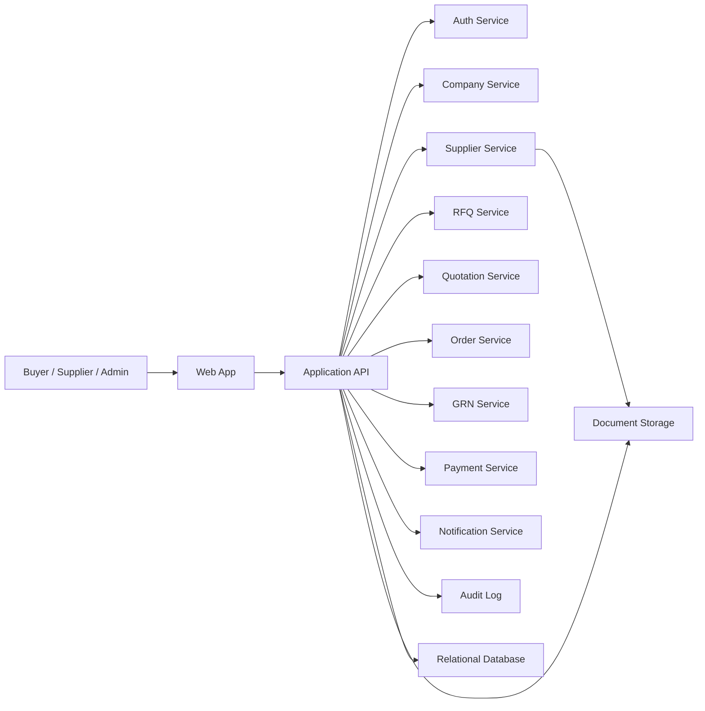

# Architecture Design

## Engineering Priorities

- Correct workflow handling over feature breadth
- Strong tenant isolation
- Explicit state transitions
- Auditability of important actions
- Simplicity first, scale later

## Proposed Stack Shape

- Frontend: React with TanStack Router
- Backend: API-first service layer
- Database: relational database
- Storage: object storage for documents
- Auth: session or token-based auth with tenant-aware claims

The current repository already aligns with a web-first frontend approach and can continue as the application shell for both marketing and authenticated product surfaces.

## Context Diagram

## Service Responsibilities

### Auth service

- User identity
- Session handling
- Role claims

### Company and user service

- Tenant creation
- Membership
- Role assignment
- Company profile

### Supplier service

- Supplier profile
- Verification submissions
- Verification status
- Supplier trust metadata

### RFQ service

- Purchase requests
- RFQ drafts and sends
- Supplier invitations
- RFQ lifecycle

### Quotation service

- Quote submission
- Quote revisions if allowed
- Quote comparison payloads

### Order service

- Purchase order creation
- PO acceptance
- Fulfillment lifecycle

### GRN service

- Receipt recording
- Quantity and quality acknowledgment
- Exception capture

### Payment service

- Payment status tracking
- Escrow state simulation for MVP
- Milestone release tracking

### Notification service

- RFQ invitations
- Workflow reminders
- Approval and verification notifications

### Audit subsystem

- Immutable log of high-value actions
- Transition snapshots
- Actor and tenant metadata

## Deployment Shape

### MVP recommendation

Start with a modular monolith:

- One deployable backend app
- Clear module boundaries
- Shared relational database
- Background job worker if needed for notifications and async tasks

This keeps implementation and deployment complexity low while preserving separation of concerns inside the codebase.

## Multi-Tenancy

Every business entity should belong to a tenant.

Rules:

- Every query must be tenant-scoped
- Tenant ID must be mandatory on protected domain objects
- Cross-tenant access should fail closed
- Admin powers should be explicit and narrow

## RBAC Model

Roles to support first:

- `platform_admin`
- `company_admin`
- `buyer_procurement`
- `buyer_finance`
- `supplier_admin`
- `supplier_sales`

## State Management Principles

- All major workflow entities need explicit status fields
- State transitions must be validated by business rules, not UI assumptions
- Transition history should be written to audit logs
- Side effects should be triggered from successful transitions only

## Document Handling

Documents include:

- GST proof
- PAN proof
- Certifications
- Invoices
- Delivery proofs

Requirements:

- Private object storage
- Metadata persisted in relational tables
- Signed access URLs or equivalent secure retrieval

## Testing Strategy

- Unit tests for validations and state transitions
- Integration tests for RFQ to PO to GRN flows
- End-to-end tests for tenant isolation and critical happy paths

## Suggested Sprint 1 Technical Focus

- Auth primitives
- Tenant-aware route protection
- User and company models
- Role enforcement baseline
- Seed data strategy
