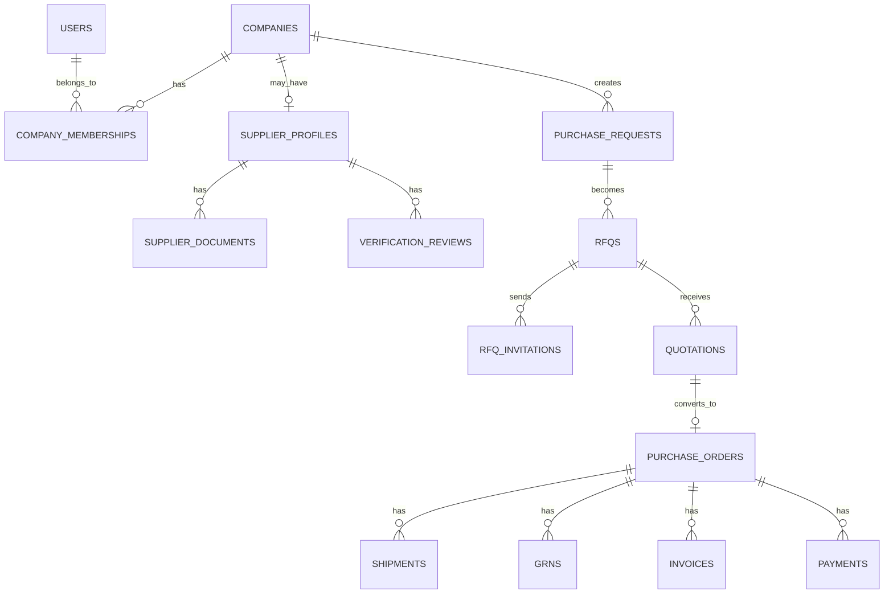

# Initial Data Model

This model is intentionally relational and optimized for correctness, workflow traceability, and tenant isolation.

## Core Principles

- Every business record belongs to a tenant unless it is truly global
- State-bearing entities should have explicit status fields
- High-value transitions should produce audit log entries
- Documents should have separate metadata records

## Entity List

- users
- companies
- company_memberships
- supplier_profiles
- supplier_documents
- verification_reviews
- purchase_requests
- rfqs
- rfq_invitations
- quotations
- purchase_orders
- shipments
- grns
- invoices
- payments
- audit_logs

## Entity Definitions

### users

| Field | Type | Notes |
| --- | --- | --- |
| id | uuid | Primary key |
| email | string | Unique identity |
| full_name | string | Display name |
| password_hash | string | Auth credential |
| created_at | timestamp | Audit baseline |
| updated_at | timestamp | Audit baseline |

### companies

| Field | Type | Notes |
| --- | --- | --- |
| id | uuid | Primary key |
| name | string | Legal or trade name |
| company_type | enum | buyer, supplier, hybrid |
| gst_number | string | Optional at creation |
| pan_number | string | Optional at creation |
| industry_category | string | High-level vertical |
| created_at | timestamp | Audit baseline |
| updated_at | timestamp | Audit baseline |

### company_memberships

| Field | Type | Notes |
| --- | --- | --- |
| id | uuid | Primary key |
| company_id | uuid | FK -> companies |
| user_id | uuid | FK -> users |
| role | enum | company_admin, buyer_procurement, buyer_finance, supplier_admin, supplier_sales |
| status | enum | invited, active, disabled |
| created_at | timestamp | Audit baseline |

### supplier_profiles

| Field | Type | Notes |
| --- | --- | --- |
| id | uuid | Primary key |
| company_id | uuid | FK -> companies |
| verification_status | enum | draft, submitted, under_review, verified, rejected |
| trust_tier | enum | pending, verified, trusted, strategic |
| trust_score | integer | Derived or managed value |
| factory_location | string | Ops metadata |
| production_capacity | string | Freeform in MVP |
| machinery_details | text | Freeform in MVP |
| delivery_capability | string | Coverage notes |
| created_at | timestamp | Audit baseline |
| updated_at | timestamp | Audit baseline |

### supplier_documents

| Field | Type | Notes |
| --- | --- | --- |
| id | uuid | Primary key |
| supplier_profile_id | uuid | FK -> supplier_profiles |
| document_type | enum | gst, pan, certification, invoice, delivery_proof, other |
| file_key | string | Object storage reference |
| status | enum | uploaded, under_review, approved, rejected |
| created_at | timestamp | Audit baseline |

### verification_reviews

| Field | Type | Notes |
| --- | --- | --- |
| id | uuid | Primary key |
| supplier_profile_id | uuid | FK -> supplier_profiles |
| reviewed_by_user_id | uuid | FK -> users |
| decision | enum | approved, rejected, needs_changes |
| notes | text | Review context |
| created_at | timestamp | Audit baseline |

### purchase_requests

| Field | Type | Notes |
| --- | --- | --- |
| id | uuid | Primary key |
| company_id | uuid | Buyer tenant |
| created_by_user_id | uuid | FK -> users |
| title | string | Internal request title |
| item_category | string | Sourcing category |
| quantity | decimal | Requested quantity |
| required_by_date | date | Planning field |
| status | enum | draft, approved, converted, cancelled |
| created_at | timestamp | Audit baseline |
| updated_at | timestamp | Audit baseline |

### rfqs

| Field | Type | Notes |
| --- | --- | --- |
| id | uuid | Primary key |
| company_id | uuid | Buyer tenant |
| purchase_request_id | uuid | FK -> purchase_requests |
| created_by_user_id | uuid | FK -> users |
| status | enum | draft, sent, closed, awarded, cancelled |
| due_at | timestamp | Quote deadline |
| payment_terms | string | MVP freeform |
| delivery_terms | string | MVP freeform |
| created_at | timestamp | Audit baseline |
| updated_at | timestamp | Audit baseline |

### rfq_invitations

| Field | Type | Notes |
| --- | --- | --- |
| id | uuid | Primary key |
| rfq_id | uuid | FK -> rfqs |
| supplier_company_id | uuid | FK -> companies |
| status | enum | invited, viewed, declined, responded |
| created_at | timestamp | Audit baseline |

### quotations

| Field | Type | Notes |
| --- | --- | --- |
| id | uuid | Primary key |
| rfq_id | uuid | FK -> rfqs |
| supplier_company_id | uuid | FK -> companies |
| submitted_by_user_id | uuid | FK -> users |
| status | enum | submitted, shortlisted, rejected, converted |
| quoted_price | decimal | Core comparison metric |
| lead_time_days | integer | Delivery estimate |
| minimum_order_quantity | decimal | Optional |
| commercial_terms | text | MVP freeform |
| created_at | timestamp | Audit baseline |
| updated_at | timestamp | Audit baseline |

### purchase_orders

| Field | Type | Notes |
| --- | --- | --- |
| id | uuid | Primary key |
| buyer_company_id | uuid | FK -> companies |
| supplier_company_id | uuid | FK -> companies |
| rfq_id | uuid | FK -> rfqs |
| quotation_id | uuid | FK -> quotations |
| status | enum | created, accepted, in_fulfillment, delivered, closed, cancelled |
| total_amount | decimal | Order amount |
| created_at | timestamp | Audit baseline |
| updated_at | timestamp | Audit baseline |

### shipments

| Field | Type | Notes |
| --- | --- | --- |
| id | uuid | Primary key |
| purchase_order_id | uuid | FK -> purchase_orders |
| status | enum | pending, dispatched, delivered |
| tracking_reference | string | Optional |
| dispatched_at | timestamp | Optional |
| delivered_at | timestamp | Optional |

### grns

| Field | Type | Notes |
| --- | --- | --- |
| id | uuid | Primary key |
| purchase_order_id | uuid | FK -> purchase_orders |
| recorded_by_user_id | uuid | FK -> users |
| status | enum | pending, recorded, accepted, disputed |
| received_quantity | decimal | Receipt evidence |
| notes | text | Quality or shortage notes |
| created_at | timestamp | Audit baseline |

### invoices

| Field | Type | Notes |
| --- | --- | --- |
| id | uuid | Primary key |
| purchase_order_id | uuid | FK -> purchase_orders |
| supplier_company_id | uuid | FK -> companies |
| invoice_number | string | Supplier reference |
| amount | decimal | Invoice value |
| status | enum | uploaded, matched, disputed, approved |
| created_at | timestamp | Audit baseline |

### payments

| Field | Type | Notes |
| --- | --- | --- |
| id | uuid | Primary key |
| purchase_order_id | uuid | FK -> purchase_orders |
| invoice_id | uuid | FK -> invoices |
| status | enum | pending, escrow_secured, partially_released, released, disputed |
| total_amount | decimal | Payable amount |
| escrow_amount | decimal | Protected component |
| released_amount | decimal | Settled amount |
| created_at | timestamp | Audit baseline |
| updated_at | timestamp | Audit baseline |

### audit_logs

| Field | Type | Notes |
| --- | --- | --- |
| id | uuid | Primary key |
| tenant_company_id | uuid | Nullable for platform-wide events |
| actor_user_id | uuid | FK -> users |
| entity_type | string | RFQ, quotation, PO, payment, etc |
| entity_id | uuid | Target entity |
| action | string | created, updated, approved, transitioned |
| from_state | string | Optional |
| to_state | string | Optional |
| metadata_json | json | Context payload |
| created_at | timestamp | Immutable event time |

## Relationship Summary

## Seed Data Recommendation

For Sprint 1 and 2 demos, seed:

- 1 platform admin
- 2 buyer companies
- 3 supplier companies
- 1 verified supplier
- 1 pending supplier
- 1 sample RFQ with 2 submitted quotes

## Future Extensions

- Buyer trust score model
- Approval workflows as dedicated entities
- Supplier performance rollups
- Escrow milestone breakdown tables
- External partner integration tables
